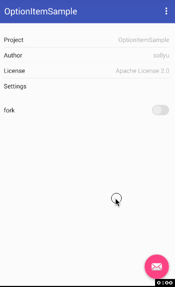

# OptionItem

## 说明

[](https://www.android.com)
[](https://jitpack.io/#kingsollyu/OptionItem)
[](https://android-arsenal.com/api?level=15)
[](https://www.apache.org/licenses/LICENSE-2.0.html)

OptionItem是一个设置选项类的界面小库，具体的界面如下。

## 截图



## 配置

### 添加仓库

```
repositories {
    maven { url 'https://jitpack.io' }
}
```

### 添加引用
使用最新版本[](https://jitpack.io/#kingsollyu/OptionItem)
```
dependencies {
    compile 'com.github.kingsollyu:OptionItem:last-version'
}
```

## 使用

具体详情请参照: 

### 选项

```xml
    <com.sollyu.android.option.item.OptionItemView
        android:id="@+id/oivAbout"
        android:layout_width="match_parent"
        android:layout_height="35dp"
        android:layout_marginTop="20dp"
        android:onClick="onClickTest"
        app:leftText="Project"
        app:rightText="@string/app_name"/>
```

### 间隔线
```xml
    <com.sollyu.android.option.item.OptionItemLine
        android:layout_width="match_parent"
        android:layout_height="0.5dp"
        android:layout_marginLeft="15dp"
        android:layout_marginRight="15dp"/>
```

### 选择
```xml
    <com.sollyu.android.option.item.OptionItemSwitch
        android:id="@+id/oisSwitch"
        android:layout_width="match_parent"
        android:layout_height="35dp"
        android:layout_marginTop="20dp"
        android:onClick="onClickSwitch"
        app:leftText="fork"/>
```

## 拓展

拓展使用库：[kyleduo-SwitchButton](https://github.com/kyleduo/SwitchButton)

## License

```
Copyright 2017 Sollyu

Licensed under the Apache License, Version 2.0 (the "License");
you may not use this file except in compliance with the License.
You may obtain a copy of the License at

   http://www.apache.org/licenses/LICENSE-2.0

Unless required by applicable law or agreed to in writing, software
distributed under the License is distributed on an "AS IS" BASIS,
WITHOUT WARRANTIES OR CONDITIONS OF ANY KIND, either express or implied.
See the License for the specific language governing permissions and
limitations under the License.
```